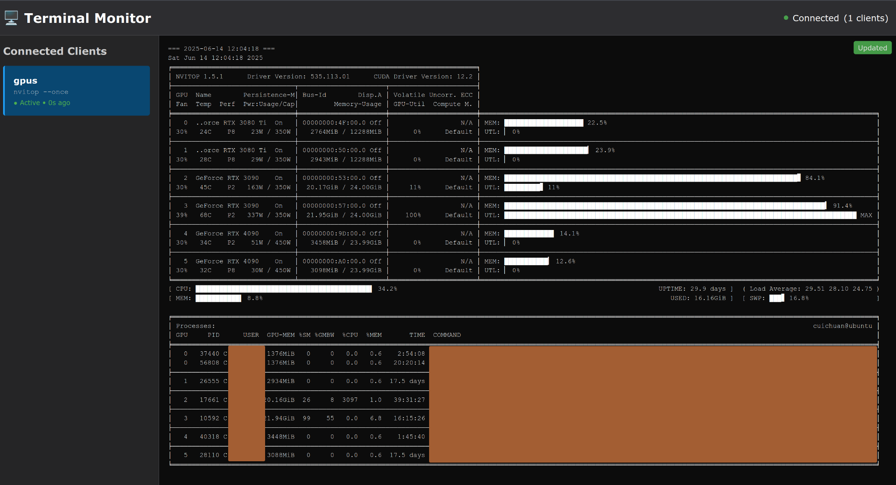
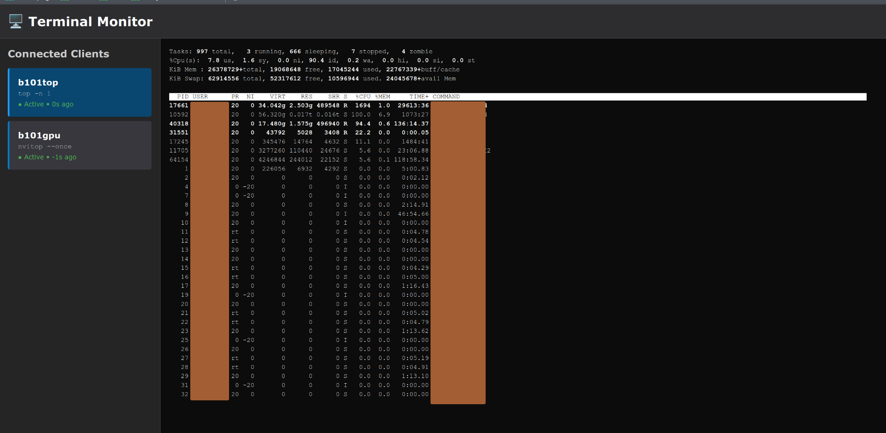

# 🖥️ TerminalHub

> **Real-time terminal monitoring for distributed systems**

[](https://python.org)
[](https://flask.palletsprojects.com/)
[](LICENSE)
[](https://github.com/features/copilot)

A modern Python Flask web application that enables real-time monitoring of terminal outputs from multiple remote clients through an elegant web interface. Perfect for monitoring GPU workloads, system resources, and distributed computing environments.

## 🤖 AI-Generated Project

**This project was created entirely using AI assistance:**
- **GitHub Copilot**: Primary code generation and development assistance
- **Claude Sonnet 4**: Advanced problem-solving, architecture design, and optimization
- **Human Role**: Project guidance, requirements specification, and testing

This demonstrates the power of AI-assisted development in creating production-ready applications with sophisticated real-time capabilities.

## ✨ Key Features

- **🔄 Real-time Monitoring**: WebSocket-powered live terminal output streaming
- **🖱️ Tabbed Interface**: Multiple clients displayed in an intuitive tabbed layout
- **🎨 Rich ANSI Support**: Full color support for nvidia-smi, htop, and other colorized tools
- **⏱️ Interval Commands**: Built-in periodic command execution with `--interval` parameter
- **🌐 Remote Access**: Monitor distributed systems from a centralized web dashboard
- **📱 Modern UI**: Dark theme with VS Code-inspired design and smooth animations
- **🔧 Terminal Control**: Proper terminal sizing and environment variable management
- **🚀 Auto-scroll**: Intelligent scrolling that follows new output
- **💾 Memory Efficient**: Smart output buffering prevents memory issues with long-running commands

## 🎯 Recent Improvements

- **🖥️ Full Terminal Emulation**: Complete ANSI escape sequence support including cursor positioning, screen clearing, and character sets
- **🎨 Rich Color Support**: Full 16-color ANSI palette with background/foreground combinations
- **⏱️ Interval Commands**: Built-in periodic command execution with `--interval` parameter
- **🔄 Smart Refresh**: Interval commands properly refresh instead of accumulating output
- **🚀 Smooth Updates**: Eliminated flickering during command refreshes with proper terminal buffering
- **🎯 Clean UI**: Streamlined interface with more space for terminal content
- **🔧 Advanced Terminal Control**: Proper terminal sizing, environment variables, and character set handling
- **🚫 Watch Alternative**: Intelligent detection and suggestion of `--interval` instead of `watch` commands

## 🚀 Quick Start

### Prerequisites

- Python 3.7+
- pip package manager

### Installation & Setup

1. **Clone the repository:**
   ```bash
   git clone <repository-url>
   cd terminalhub
   ```

2. **Install dependencies:**
   ```bash
   pip install -r requirements.txt
   ```

3. **Start the server:**
   ```bash
   python server.py
   # OR use the convenience script:
   ./start_server.sh
   ```

4. **Connect your first client:**
   ```bash
   # Monitor GPU status with nvidia-smi
   python client.py --cmd 'nvidia-smi' --server localhost:30080 --title 'GPU Monitor' --interval 2
   ```

5. **Open your browser to:** `http://localhost:30080`

### 🎮 Try the Demo

Run the included demo to see all features in action:

```bash
# Start server and demo clients
./demo.sh start
./demo.sh test

# Clean up when done
./demo.sh stop
```

## 📖 Usage Guide

### Server Setup

Start the Flask server on your monitoring machine:

```bash
python server.py
```

The server runs on `http://0.0.0.0:30080` by default and accepts connections from any IP address.

### Client Connections

Connect terminal commands from any machine that can reach the server:

#### 🖥️ GPU Monitoring Examples

```bash
# NVIDIA GPU monitoring with 1-second updates
python client.py --cmd 'nvidia-smi' --server 192.168.1.100:30080 --title 'GPU Node 1' --interval 1

# Detailed GPU metrics
python client.py --cmd 'nvidia-smi --query-gpu=name,temperature.gpu,utilization.gpu,memory.used,memory.total --format=csv' --server 192.168.1.100:30080 --title 'GPU Details' --interval 2

# Single-shot nvitop overview
python client.py --cmd 'nvitop -1' --server 192.168.1.100:30080 --title 'GPU Overview'

# AMD GPU monitoring
python client.py --cmd 'rocm-smi' --server 192.168.1.100:30080 --title 'ROCm SMI' --interval 2
```

#### 🔧 System Monitoring Examples

```bash
# System resources overview
python client.py --cmd 'free -h && echo && ps aux --sort=-%cpu | head -10' --server 192.168.1.100:30080 --title 'System Resources' --interval 3

# Disk usage monitoring
python client.py --cmd 'df -h' --server 192.168.1.100:30080 --title 'Disk Usage' --interval 5

# Network interface statistics
python client.py --cmd 'netstat -i' --server 192.168.1.100:30080 --title 'Network Stats' --interval 2

# Process monitoring with htop
python client.py --cmd 'htop' --server 192.168.1.100:30080 --title 'Process Monitor'
```

#### 📋 Log Monitoring Examples

```bash
# System log tail
python client.py --cmd 'tail -f /var/log/syslog' --server 192.168.1.100:30080 --title 'System Logs'

# Custom application logs
python client.py --cmd 'tail -f /path/to/app.log' --server 192.168.1.100:30080 --title 'App Logs'

# Journal logs
python client.py --cmd 'journalctl -f' --server 192.168.1.100:30080 --title 'Journal Logs'
```

## ⚙️ Configuration Options

### Client Parameters (`client.py`)

| Parameter | Description | Required | Example |
|-----------|-------------|----------|---------|
| `--cmd` | Command to execute | ✅ | `'nvidia-smi'` |
| `--server` | Server address (ip:port) | ✅ | `'192.168.1.100:30080'` |
| `--title` | Display title for client tab | ✅ | `'GPU Node 1'` |
| `--interval` | Repeat interval in seconds | ❌ | `2` |

### Server Configuration

The server can be configured by modifying `server.py`:

```python
# Default configuration
HOST = '0.0.0.0'  # Accept connections from any IP
PORT = 30080       # Server port
```

### Environment Variables

The client sets optimized terminal environment variables:

```bash
TERM=xterm
COLUMNS=180
LINES=40
DEBIAN_FRONTEND=noninteractive
```

## Example Commands

### For GPU Monitoring:
```bash
# NVIDIA GPU monitoring (recommended: use interval instead of watch)
python client.py --cmd 'nvidia-smi' --server 192.168.1.100:30080 --title 'GPU States - Node 1' --interval 1
python client.py --cmd 'nvidia-smi --query-gpu=name,temperature.gpu,utilization.gpu,memory.used,memory.total --format=csv' --server 192.168.1.100:30080 --title 'GPU Details - Node 2' --interval 2

# Single-shot nvitop
python client.py --cmd 'nvitop -1' --server 192.168.1.100:30080 --title 'GPU Overview - Node 1'

# AMD GPU monitoring  
python client.py --cmd 'rocm-smi' --server 192.168.1.100:30080 --title 'ROCm SMI - Node 3' --interval 2
```

### For System Monitoring:
```bash
# System resources
python client.py --cmd 'htop' --server 192.168.1.100:30080 --title 'System Resources'
python client.py --cmd 'top' --server 192.168.1.100:30080 --title 'Process Monitor'

# Network monitoring
python client.py --cmd 'watch -n 1 netstat -i' --server 192.168.1.100:30080 --title 'Network Stats'

# Memory usage
python client.py --cmd 'watch -n 2 free -h' --server 192.168.1.100:30080 --title 'Memory Usage'
```

### For Custom Scripts:
```bash
# Custom monitoring script
python client.py --cmd 'python my_monitor.py' --server 192.168.1.100:30080 --title 'Custom Monitor'

# Log file monitoring
python client.py --cmd 'tail -f /var/log/syslog' --server 192.168.1.100:30080 --title 'System Logs'
```

## 🔧 API Reference

### HTTP Endpoints

| Method | Endpoint | Description |
|--------|----------|-------------|
| `GET` | `/` | Web interface |
| `POST` | `/register` | Register a new client |
| `POST` | `/update` | Send output update from client |
| `POST` | `/disconnect` | Handle client disconnect |
| `GET` | `/api/clients` | Get list of connected clients |
| `GET` | `/api/output/<client_id>` | Get output for specific client |

### WebSocket Events

| Event | Direction | Description |
|-------|-----------|-------------|
| `client_registered` | Server → Browser | New client connected |
| `client_disconnected` | Server → Browser | Client disconnected |
| `output_update` | Server → Browser | New output from client |
| `clients_list` | Server → Browser | Initial client list on connect |

## 🌐 Network Setup

### Firewall Configuration

Ensure the server port (default 30080) is accessible:

```bash
# Ubuntu/Debian
sudo ufw allow 30080

# CentOS/RHEL
sudo firewall-cmd --add-port=30080/tcp --permanent
sudo firewall-cmd --reload
```

### Multi-Machine Setup

1. **Server Machine**: Run `python server.py`
2. **Client Machines**: Connect using server's IP address
3. **Web Access**: Any machine can access `http://server-ip:30080`

Example for distributed GPU cluster monitoring:

```bash
# On monitoring server (192.168.1.100)
python server.py

# On GPU node 1 (192.168.1.101)
python client.py --cmd 'nvidia-smi' --server 192.168.1.100:30080 --title 'GPU Node 1' --interval 1

# On GPU node 2 (192.168.1.102)
python client.py --cmd 'nvidia-smi' --server 192.168.1.100:30080 --title 'GPU Node 2' --interval 1

# Access from any machine: http://192.168.1.100:30080
```

## 🛠️ Troubleshooting

### Common Issues

#### Connection Problems
```bash
# Check if server is running
curl http://localhost:30080

# Verify port availability
netstat -tlnp | grep :30080

# Test firewall settings
telnet server-ip 30080
```

#### Client Registration Failures
- Ensure server URL format is correct: `ip:port` (no http://)
- Check network connectivity between client and server
- Verify server is accepting connections (`0.0.0.0` binding)

#### Performance Issues
- High CPU usage with many clients: Increase update intervals
- Memory growth: The system auto-limits output to prevent memory issues
- Network lag: Consider local deployment for high-frequency monitoring

#### Terminal Output Issues
```bash
# Test ANSI color support
python client.py --cmd 'echo -e "\033[31mRed\033[0m \033[32mGreen\033[0m"' --server localhost:30080 --title 'Color Test'

# Debug command execution
python client.py --cmd 'echo $TERM $COLUMNS $LINES' --server localhost:30080 --title 'Env Test'
```

### Getting Help

1. Check the [Issues](../../issues) section for common problems
2. Enable debug mode by modifying `server.py`:
   ```python
   app.run(debug=True, host='0.0.0.0', port=30080)
   ```
3. Monitor server logs for error messages

## 🏗️ Architecture

The system uses a modern client-server architecture with real-time communication:

```
┌─────────────────┐    WebSocket/HTTP    ┌─────────────────┐
│   Web Browser   │◄────────────────────►│  Flask Server   │
│                 │                      │                 │
│ • Real-time UI  │                      │ • WebSocket Hub │
│ • ANSI Renderer │                      │ • Client Mgmt   │
│ • Auto-scroll   │                      │ • Output Buffer │
└─────────────────┘                      └─────────┬───────┘
                                                   │
                                                   │ HTTP API
                                    ┌──────────────┼──────────────┐
                                    │              │              │
                             ┌──────▼──────┐ ┌────▼─────┐ ┌─────▼─────┐
                             │   Client 1  │ │ Client 2 │ │ Client N  │
                             │             │ │          │ │           │
                             │ nvidia-smi  │ │   htop   │ │  custom   │
                             │ (interval)  │ │ (live)   │ │  script   │
                             └─────────────┘ └──────────┘ └───────────┘
                              Remote Node 1   Local        Remote Node N
```

### Component Overview

- **Flask Server**: Central hub managing WebSocket connections and client communications
- **Web Interface**: React-like real-time UI with ANSI color rendering
- **Terminal Clients**: Lightweight Python scripts running commands on remote machines
- **WebSocket Communication**: Enables instant output updates without page refreshes

## 📷 Screenshots

### GPU Monitoring Example

*nvitop output*

### System Resources View

*Processes monitoring dashboard*

## 🤝 Contributing

This project demonstrates AI-assisted development capabilities. Contributions are welcome!

### Development Setup

1. Fork the repository
2. Clone your fork: `git clone <your-fork-url>`
3. Install dependencies: `pip install -r requirements.txt`
4. Make your changes
5. Test with: `./demo.sh start && ./demo.sh test`
6. Submit a pull request

### Code Style

- Follow PEP 8 for Python code
- Use meaningful variable names
- Add comments for complex logic
- Test changes with multiple clients

## 📋 Roadmap

- [ ] **Authentication**: Add user authentication and authorization
- [ ] **SSL/HTTPS**: Secure connections for production use
- [ ] **Client Grouping**: Organize clients into logical groups
- [ ] **Export Features**: Download logs and screenshots
- [ ] **Mobile Support**: Responsive design for mobile devices
- [ ] **Plugin System**: Custom renderers for specific tools
- [ ] **Performance Metrics**: Built-in monitoring of system performance
- [ ] **Docker Support**: Containerized deployment options

## 📄 License

```
MIT License

Copyright (c) 2025 AI-Generated Project (GitHub Copilot + Claude Sonnet 4)

Permission is hereby granted, free of charge, to any person obtaining a copy
of this software and associated documentation files (the "Software"), to deal
in the Software without restriction, including without limitation the rights
to use, copy, modify, merge, publish, distribute, sublicense, and/or sell
copies of the Software, and to permit persons to whom the Software is
furnished to do so, subject to the following conditions:

The above copyright notice and this permission notice shall be included in all
copies or substantial portions of the Software.

THE SOFTWARE IS PROVIDED "AS IS", WITHOUT WARRANTY OF ANY KIND, EXPRESS OR
IMPLIED, INCLUDING BUT NOT LIMITED TO THE WARRANTIES OF MERCHANTABILITY,
FITNESS FOR A PARTICULAR PURPOSE AND NONINFRINGEMENT. IN NO EVENT SHALL THE
AUTHORS OR COPYRIGHT HOLDERS BE LIABLE FOR ANY CLAIM, DAMAGES OR OTHER
LIABILITY, WHETHER IN AN ACTION OF CONTRACT, TORT OR OTHERWISE, ARISING FROM,
OUT OF OR IN CONNECTION WITH THE SOFTWARE OR THE USE OR OTHER DEALINGS IN THE
SOFTWARE.
```

---

**⭐ If you find this project useful, please consider giving it a star!**

**🤖 Built with AI • 🚀 Powered by Innovation • 💻 Made for Developers**
